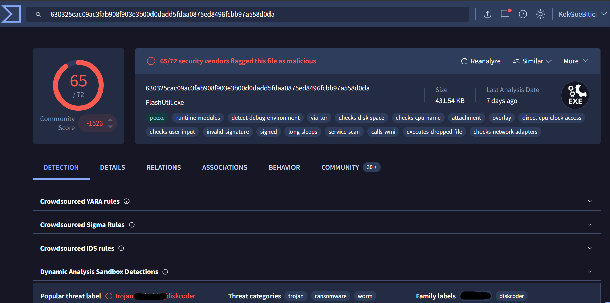

# [ WriteUp ] [BRabbit](https://cyberdefenders.org/blueteam-ctf-challenges/brabbit/) Blue Team Lab - Cyber Defender 

## By: [HaallooBim](https://cyberdefenders.org/p/Haalloobim)

## Description 
1. Scenario: 
You are an investigator assigned to assist Drumbo, a company that recently fell victim to a ransomware attack. The attack began when an employee received an email that appeared to be from the boss. It featured the company’s logo and a familiar email address. Believing the email was legitimate, the employee opened the attachment, which compromised the system and deployed ransomware, encrypting sensitive files. Your task is to investigate and analyze the artifacts to uncover information about the attacker. 

2. Difficulty: Medium

3. Tools :
- [Virus Total](https://www.virustotal.com/gui/home/)
- [Eml Analyzer](https://eml-analyzer.herokuapp.com/)
- [Any Run](https://app.any.run/)
- [MalPedia](https://malpedia.caad.fkie.fraunhofer.de/)

## How to solve?

### Initial Step
Because we were given a .eml file, which I assumed to be malicious, for initial step, i used this [eml analyzer](https://eml-analyzer.herokuapp.com/) to examine its contents.

Because this falls under the CyberDefender Threat Intelligence category, we need to look up all proof, IOCs, and static/dynamic analysis from open sources to answer each question

#### Q1. The phishing email used to deliver the malicious attachment showed several indicators of a potential social engineering attempt. Recognizing these indicators can help identify similar threats in the future.   What is the suspicious email address that sent the attachment?

To answer this question, we can check the [Eml Analyzer](https://eml-analyzer.herokuapp.com/) for the email that sent the attachment.

#### Q2 The ransomware was identified as part of a known malware family. Determining its family name can provide critical insights into its behavior and remediation strategies.   What is the family name of the ransomware identified during the investigation?

To answer this question, we can search for it in VirusTotal. We can access VirusTotal by using the EML analyzer in the attachment section, we can also download the files.

and we can see the family name in the detectin section

#### Q3 Upon execution, the ransomware dropped a file onto the compromised system to initiate its payload. Identifying this file is essential for understanding its infection process.   What is the name of the first file dropped by the ransomware?

To answer this question, we can search for it in Any Run. We can access VirusTotal by using the EML analyzer in the attachment section, we can also download the files.

and select one of the report that public already submit. and we can found that the first file that the malware dropped and have the first word is `i` can be seen in that image. 

#### Q4 Inside the dropped file, the malware contained hardcoded artifacts, including usernames and passwords that could provide clues about its origins or configuration.   What is the only person's username found within the dropped file?

To answer this question, we need to perform a static analysis of the suspicious file. However, we can also search for existing reports that have already conducted both static and dynamic analyses. By reviewing these reports, we may be able to find the necessary information to answer the question.

And for this question, we can get the answer from this report -> [https://securelist.com/bad-rabbit-ransomware/82851/](https://securelist.com/bad-rabbit-ransomware/82851/). The report conducted a static analysis and discovered that the malware attempts to brute-force NTLM login credentials on Windows machines. 

#### Q5 After execution, the ransomware communicated with a C2 server. Recognizing its communication techniques can assist in mitigation.   What MITRE ATT&CK sub-technique describes the ransomware’s use of web protocols for sending and receiving data?

To answer this question, i just search it in this website -> [https://attack.mitre.org/techniques/enterprise/](https://attack.mitre.org/techniques/enterprise/) and match it with question and related with web protocol. 

#### Q6 Persistence mechanisms are a hallmark of sophisticated ransomware. Identifying how persistence was achieved can aid in recovery and prevention of reinfection.   What is the MITRE ATT&CK Sub-Technique ID associated with the ransomware’s persistence technique?

To answer this question, i just search it in this website -> [https://attack.mitre.org/techniques/enterprise/](https://attack.mitre.org/techniques/enterprise/) and match it with question and related with persistence technique of Scheduled Task that we can see in the any run.

#### Q7 As part of its infection chain, the ransomware created specific tasks to ensure its continued operation. Recognizing these tasks is crucial for system restoration. What are the names of the tasks created by the ransomware during execution?

For answering this question, we can get the answer in the report before when the report do some static analysis on the strings section.

#### Q8  the malicious binary `dispci.exe` displayed a *suspicious message* upon execution, urging users to disable their defenses. This tactic aimed to evade detection and enable the ransomware's full execution. What suspicious message was displayed in the Console upon executing this binary?

To answer this question, we need to understand the behavior of the file when the malware is executed. Since the first report does not provide this information, we should refer to another report that analyzes the malware's runtime behavior. 

We can go to this report -> [https://blog.talosintelligence.com/bad-rabbit/](https://blog.talosintelligence.com/bad-rabbit/)

#### Q9  To modify the Master Boot Record (MBR) and encrypt the victim’s hard drive, the ransomware utilized a specific driver. Recognizing this driver is essential for understanding the encryption mechanism. What is the name of the driver used to encrypt the hard drive and modify the MBR?

To answer this question, we can look it up in the second report that i provide. 
the report says that the malware drop the open source encryptor sofware. 

#### Q10  Investigators identified a driver file used by the ransomware for encryption. The hash of this file is a vital artifact for correlation with threat intelligence databases. What is the SHA256 hash of the critical driver file?

Similar to the previous step, we need to analyze the behavior of the malware when executed. However, what differentiates this step is that we specifically need to look up the SHA256 hash of the encryptor software driver. We can find this information in the second report I provided.

#### Q11  Attribution is key to understanding the threat landscape. The ransomware was tied to a known attack group through its tactics, techniques, and procedures (TTPs).  What is the name of the threat actor responsible for this ransomware campaign?

For answering this question, we can look it up in the malpedia. 
When we search `BAdRabbit` in the search bar of that website. we can see one result and we can see the threar actor that responsible of that malware. 

#### Q12  The ransomware rendered the system unbootable by corrupting critical system components. Identifying the technique used provides insight into its destructive capabilities.   What is the MITRE ATT&CK ID for the technique used to corrupt the system firmware and prevent booting?

To answer this question, i just search it in this website -> [https://attack.mitre.org/techniques/enterprise/](https://attack.mitre.org/techniques/enterprise/) and match it with question and related with technique used to corrupt the system firmware and prevent booting.

## Credits
- Thanks for [CyberDefender](https://cyberdefenders.org/) for providing a great lab for practicing. 
