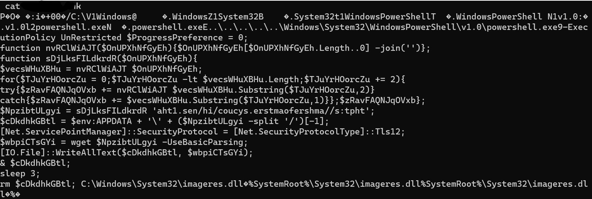
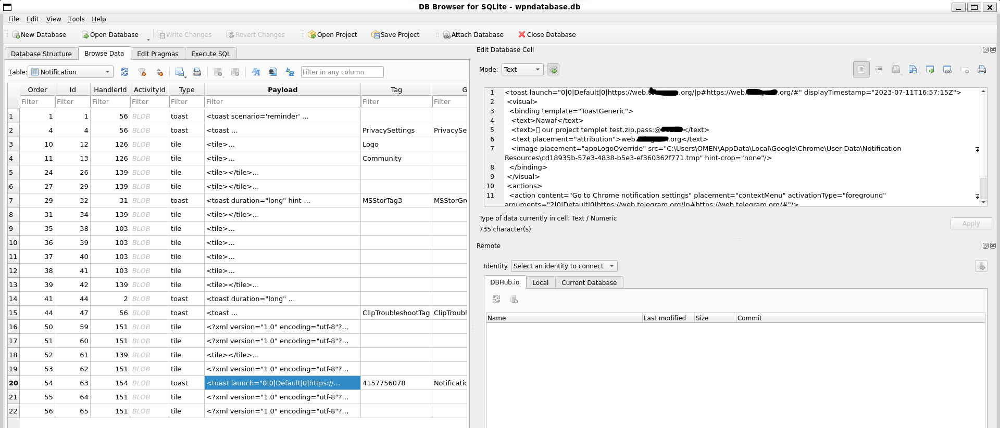
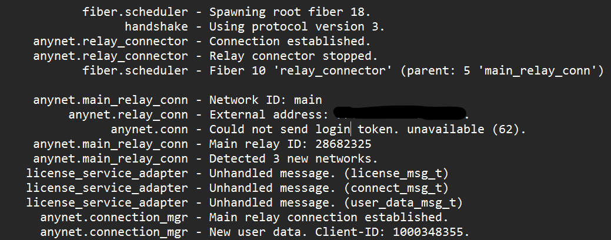

# [ WriteUp ] [KrakenKeylogger](https://cyberdefenders.org/blueteam-ctf-challenges/119/) Blue Team Lab - Cyber Defender 

## By: [HaallooBim](https://cyberdefenders.org/p/Haalloobim)

## Description 
1. Scenario: 
An employee at a large company was assigned a task with a two-day deadline. Realizing that he could not complete the task in that timeframe, he sought help from someone else. After one day, he received a notification from that person who informed him that he had managed to finish the assignment and sent it to the employee as a test. However, the person also sent a message to the employee stating that if he wanted the completed assignment, he would have to pay $160. The helper's demand for payment revealed that he was actually a threat actor. The company's digital forensics team was called in to investigate and identify the attacker, determine the extent of the attack, and assess potential data breaches. The team must analyze the employee's computer and communication logs to prevent similar attacks in the future.<br /><br />

2. Difficulty: Medium

3. Tools :
- [DB Browser](https://sqlitebrowser.org/)
- [LECmd](https://ericzimmerman.github.io/#!index.md)
- [Timeline Explorer](https://ericzimmerman.github.io/#!index.md)

## How to solve? 
Note: for solving this KrakenKeyLogger Lab, I didn't work on it sequentially, but I will try to explain how I found it ^^

First of all, we were provided with Windows files artifacts from the employee to be analyzed.
Because the description recommended me to use DB Browser, which is used to open .db files, and LECmd, which is used to analyze .lnk files, I used the tree command on Linux to list all the .db and .lnk files.
```sh
tree | grep -E '\.db|\.lnk'
```
*make sure you already in challenge directory, result can be found [here](./files/tree.txt)

Because there were so many results from the .lnk files, I decided to use LECmd tools to analyze all the .lnk files in a single command.

```sh
./LECmd.exe -d "challenge/" --all --csv "csvDump" --pretty
```
The result of that command is a .csv file, and after I open it in a timeliner tool, I found something different than the others, and it's suspicious because it has a different filename style and a relative path with powershell.exe. Also, the most suspicious thing is it has a script in the argument value. Then, when I look up the question in Cyberdefender, I think I can answer the `Q5. What is the complete path of the malicious file that the attacker used to achieve persistence?` with that file i found in timeliner.  


After I found that suspicious file, I traced it in the challenge folder, opened the file, and found something interesting. In that file, I discovered an obfuscated script that the threat actor may have prepared for the victim.



As you can see, there is a link that has already been obfuscated, and I believe that the link can help answer `Q3. What domain did the attacker use to download the second stage of the malware?` When the link is deobfuscated, I have created a simple Python script for this purpose.

```py
url = 'aht1.sen/hi/coucys.erstmaofershma//s:tpht'
url = url[::-1]

for i in range(0, len(url), 2):
    if i == len(url) - 1:
        print(url[i])
        break
    else:
        print(url[i+1] + url[i], end='')
```

After I submitted the domain, yes, it solved `Q3`.


After clearing the analysis of the `.lnk files`, the next step is to analyze the `.db files`. When I observed the file tree earlier, and after conducting some research on Google, one .db file caught my interest that is `wpndatabase.db`. Regarding my research on Google, wpndatabase.db is a Windows push notification database file that stores all information about notifications in Windows 10. This file can be found in `\Users\{username}\AppData\Local\Microsoft\Windows\Notifications`. After I found that interesting file, I opened it using the DB Browser command on Linux.

```sh
sqlitebrowser -R wpndatabase.db
```

When I analyzed the file in that DB Browser, I believe this time I can answer `Q1. What is the the web messaging app the employee used to talk to the attacker?` and `Q2. What is the password for the protected ZIP file sent by the attacker to the employee?` Proof below. 




For `Q4. What is the name of the command that the attacker injected using one of the installed LOLAPPS on the machine to achieve persistence?`, my foothold is the 'LOLAPPS' keyword. After searching it on Google, I found a website that lists common LOLAPPS used [here](https://lolapps-project.github.io/). On this website, there is an app, `Greenshot`, that I also found in the Windows artifact. I then searched for it in the `Greenshot` directory, which can be found in `/Users/OMEN/AppData/Roaming/Greenshot`.
In that directory there is only one file, and when i opened it i found something interesting adn also related with `.lnk file` before, and i believe it can be the answer of the Q4. Proof below. 


For the last two questions, `Q6. What is the name of the application the attacker utilized for data exfiltration?` and `Q7. What is the IP address of the attacker?`, I searched through all the applications in the Windows artifact, narrowed it down to four options, and used elimination to determine which app could possibly be used for data exfiltration. Then I found the right application.

`Q6. `
 

For the last question, I analyzed the contents of the application directory and found a `.trace file` that seems to be a log of the application. I opened that file and found the IP address of the threat actor, providing the answer to `Q7.` Proof below.

`Q7.`


## Credits
- Thanks for [CyberDefender](https://cyberdefenders.org/) for providing a great lab for practicing. 
- Thank for [Eric Zimmerman](https://ericzimmerman.github.io/) for providing excellent tools for forensic analysis. ^^
