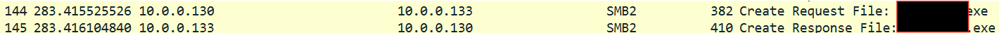

# [ WriteUp ] [PsExec](https://cyberdefenders.org/blueteam-ctf-challenges/psexec-hunt/) Blue Team Lab - Cyber Defender 

## By: [HaallooBim](https://cyberdefenders.org/p/Haalloobim)

## Description 
1. Scenario:
Our Intrusion Detection System (IDS) has raised an alert, indicating suspicious lateral movement activity involving the use of PsExec. To effectively respond to this incident, your role as a SOC Analyst is to analyze the captured network traffic stored in a PCAP file.

2. Tools :
- [WireShark](https://www.wireshark.org/)

## How to solve? 
For completing this lab, I will use the Wireshark tool to analyze this [pcapng](./files/psexec-hunt.pcapng) file. 
The screenshot below shows the Wireshark interface when the file was loaded for the first time. There are `40294 packets` inside it.

### Q1. In order to effectively trace the attacker's activities within our network, can you determine the IP address of the machine where the attacker initially gained access?

To determine the IP address of the machine where the attacker initially gained access, first of all, we need to identify the packet where the attack began. 
When I analyzed the file, the most suspicious activity began in packet `number 126`, which was the first `SMB protocol` in that pcapng file. Here is the proof below. 

The answer to the first question is the source IP address of packet number 126.

### Q2. To fully comprehend the extent of the breach, can you determine the machine's hostname to which the attacker first pivoted?

To determine the hostname of the machine to which the attacker first pivoted, we can check packets number 130 and 131, where there are session requests and responses.

When checking further into `packets number 131's Target Info`, we can find the machine's hostname/domain name in those packets. Here is the proof below.

### Q3. After identifying the initial entry point, it's crucial to understand how far the attacker has moved laterally within our network. Knowing the username of the account the attacker used for authentication will give us insights into the extent of the breach. What is the username utilized by the attacker for authentication?

To determine the username utilized by the attacker for authentication, we can check in the `packets number of 132`. there is a username value in that packet. Here is the proof below.

 

### Q4. After figuring out how the attacker moved within our network, we need to know what they did on the target machine. What's the name of the service executable the attacker set up on the target?

To determine the name of the service executable the attacker set up on the target, we can check the `packets number of 144 and 145`. There is a suspicious file that indicate this malicious activity in this network. Here is the proof below. 

### Q5. We need to know how the attacker installed the service on the compromised machine to understand the attacker's lateral movement tactics. This can help identify other affected systems. Which network share was used by PsExec to install the service on the target machine?

To determine Which network share was used by PsExec to install the service on the target machine, we can check the `packets number of 138`. There is a endpoint that refer to network share. Here is the proof below. 

### Q6. We must identify the network share used to communicate between the two machines. Which network share did PsExec use for communication?

To determine Which network share did PsExec use for communication, we can check the `packets number of 134`. There is a endpoint that refer to network share. Here is the proof below. 

### Q7. Now that we have a clearer picture of the attacker's activities on the compromised machine, it's important to identify any further lateral movement. What is the machine's hostname to which the attacker attempted to pivot within our network?

For searching the hostname to which the attacker attempted to pivot within our network, i analyze like the `Q2` but at the almost end of the captured network. As we can see at `packets number of 38533 and 38534`, there are suspicious session request and response. Here the screenshoot below.

When we analyze more, we can find the hostname in the `Target Info` section. Here is the proof below. 

_nb: For answering Q5 and Q6, honestly, I just matched the format with the information in the suspicious block of packets, so bear with me ^^_

## Credits
- Thanks for [CyberDefender](https://cyberdefenders.org/) for providing a great lab for practicing. 