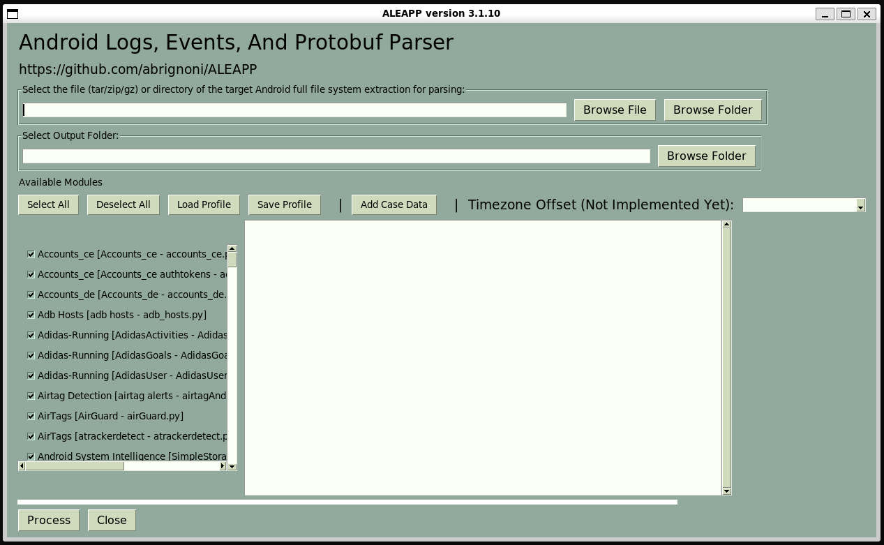
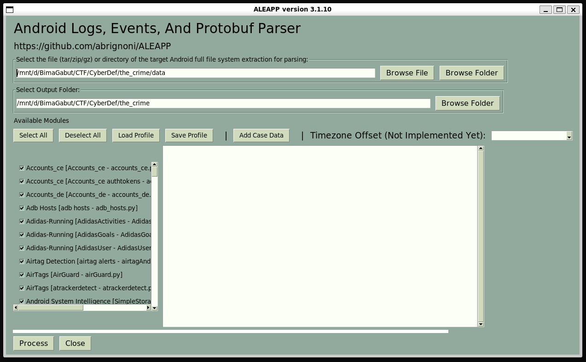
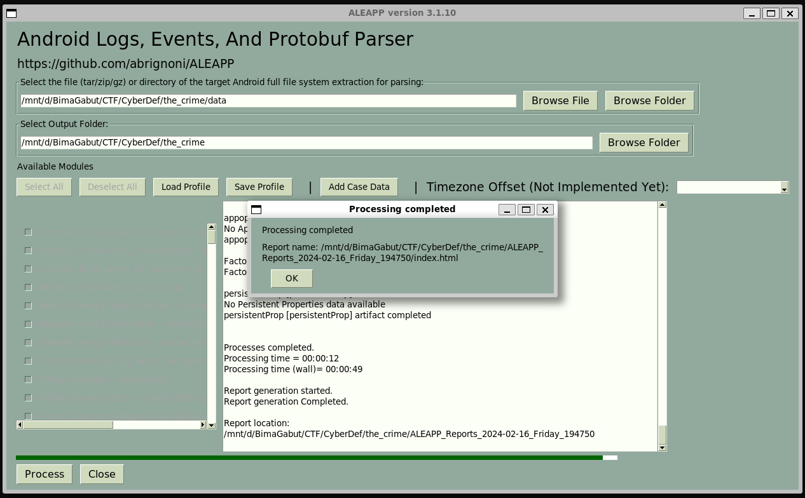
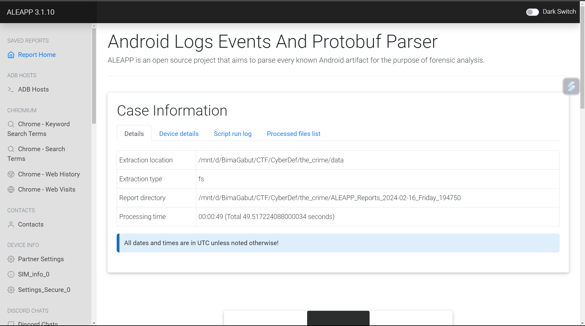
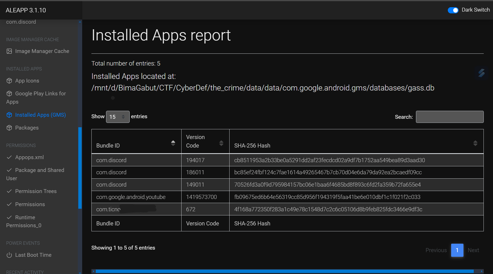
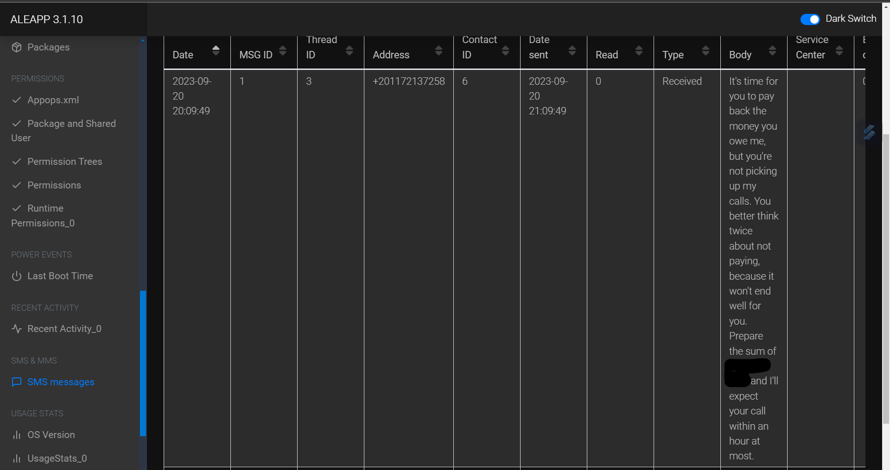
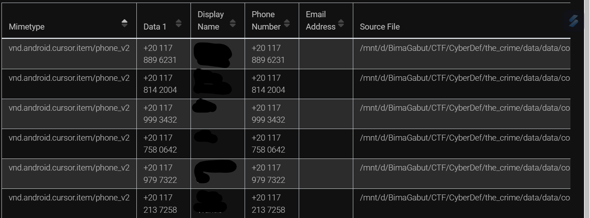
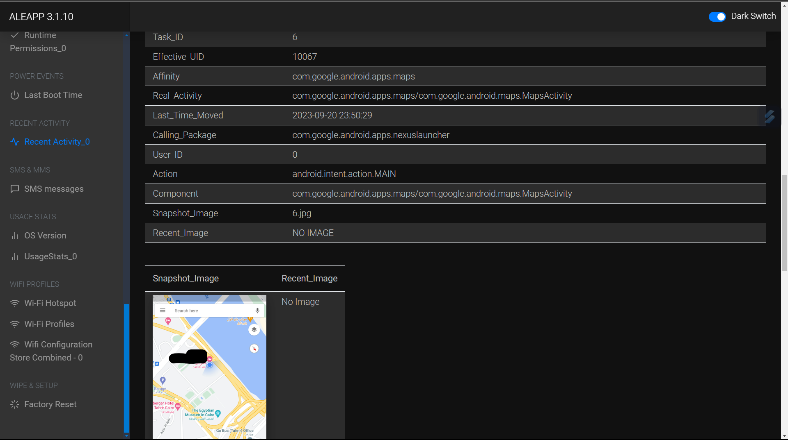
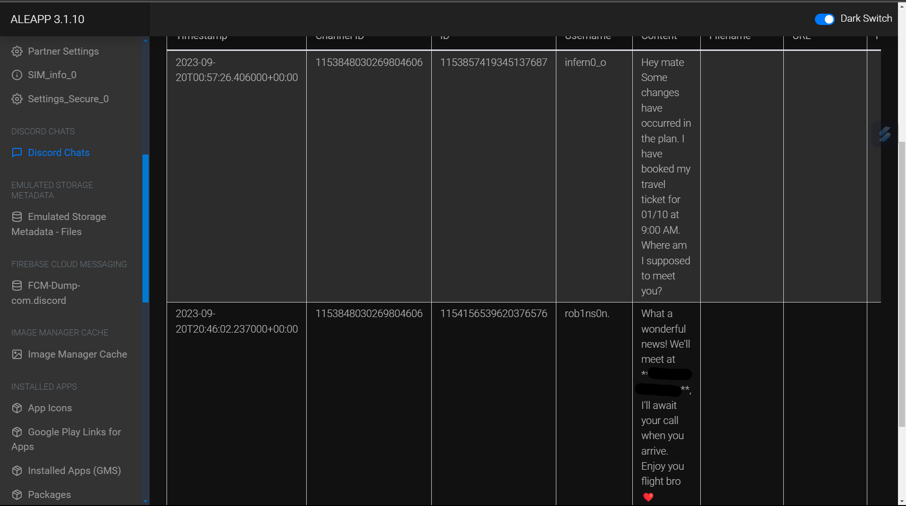
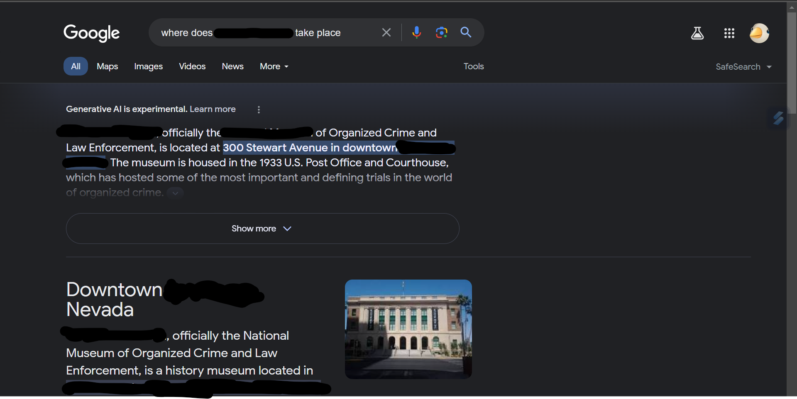

# [ WriteUp ] [The Crime](https://cyberdefenders.org/blueteam-ctf-challenges/the-crime/) Blue Team Lab - Cyber Defender 

## By: [HaallooBim](https://cyberdefenders.org/p/Haalloobim)

## Description 
1. Scenario: 
We're currently in the midst of a murder investigation, and we've obtained the victim's phone as a key piece of evidence. After conducting interviews with witnesses and those in the victim's inner circle, your objective is to meticulously analyze the information we've gathered and diligently trace the evidence to piece together the sequence of events leading up to the incident.<br>

2. Difficulty: Easy

3. Tools :
- [DB Browser](https://sqlitebrowser.org/)
- [ALEAPP](https://github.com/abrignoni/ALEAPP)

## How to solve?

### Initial Step
For the initial step, i used [ALEAPP Tool](https://github.com/abrignoni/ALEAPP) to parse the Android artifacts. I executed the following command to open the GUI version of the ALEAPP tool.

```sh
python3 aleappGUI.py
```
After executing that command, the interface of the ALEAPP tool appeared. Here's a screenshot of the interface.



After that, we can choose the data we want to parse and select the output folder to contain the result. Then, we wait until the process is complete. Here's a screenshot of it.





And finally, we can open the `index.html` file to view the result of the parsing process.



### Q1. Based on the accounts of the witnesses and individuals close to the victim, it has become clear that the victim was interested in trading. This has led him to invest all of his money and acquire debt. Can you identify which trading application the victim primarily used on his phone?

For this question, we need to find the applications installed on the user's device. In the ALEAPP tool, we can search for this information in the `Installed Apps` tab. Additionally, we have to identify any apps that correlate with trading apps. The answer is shown in the screenshot below with sensitive information censored.



### Q2. According to the testimony of the victim's best friend, he said, "While we were together, my friend got several calls he avoided. He said he owed the caller a lot of money but couldn't repay now". How much does the victim owe this person?

For this question, we need to determine the amount owed by the victim to a specific person.  First of all, i think we have to know the how the victim communication with the person. In the ALEAPP tool, we can search for this information in the `SMS Messages` tab. Within that tab, we can ascertain the exact amount owed by the victim to this person. The answer is displayed in the screenshot below, with sensitive information censored.



### Q3. What is the name of the person to whom the victim owes money?
To answer this question, we have to find the person to whom the victim owes money. First of all, we can refer to the previous question. In the previous question, there is a phone number that leads to the chat. From that phone number, we can search it in the Contacts page that has the number before. The answer is displayed in the screenshot below, with sensitive information censored.



### Q4. Based on the statement from the victim's family, they said that on September 20, 2023, he departed from his residence without informing anyone of his destination. Where was the victim located at that moment?

To answer this question, we can refer to the `Recent Activity_0` page. Since we need to find where the victim was located, we can search for that information there. There is a screenshot in the `Recent Activity_0` page that leads to the answer. The answer is displayed in the screenshot below, with sensitive information censored.



### Q5. The detective continued his investigation by questioning the hotel lobby. She informed him that the victim had reserved the room for 10 days and had a flight scheduled thereafter. The investigator believes that the victim may have stored his ticket information on his phone. Look for where the victim intended to travel 

### Q6. After examining the victim's Discord conversations, we discovered he had arranged to meet a friend at a specific location. Can you determine where this meeting was supposed to occur?

For answering `Q5`, i will also answering the `Q6`. First of all, we can refer to the `Discord Chat` page to find where the person does the meeting. In that chat, we can determine where the person meets. This information can answer `Q6`. The answer to `Q6` is displayed in the screenshot below, with sensitive information censored.



For answering `Q5`, we can look up the specific location where the meeting occurs. First of all, we can Google the location that we obtained earlier. The answer to `Q5` is displayed in the screenshot below, with sensitive information censored.




## Credits
- Thanks for [CyberDefender](https://cyberdefenders.org/) for providing a great lab for practicing. 
